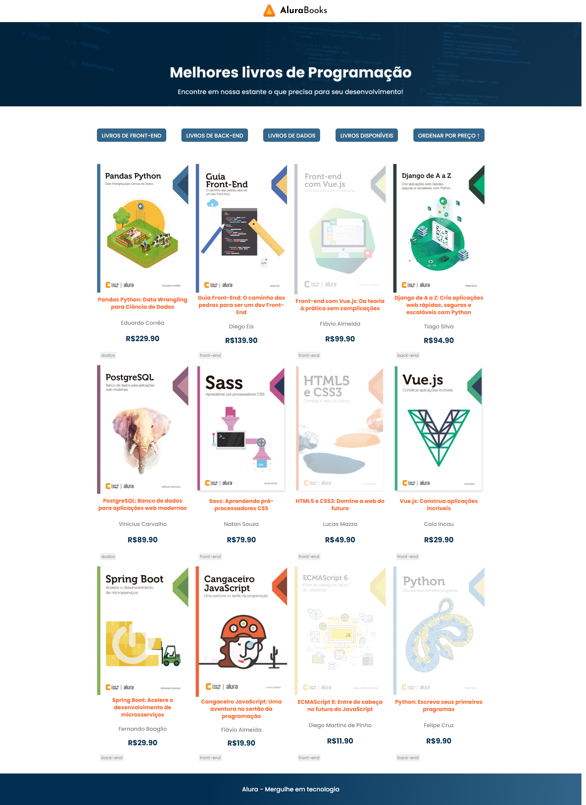

  

AluraBook é uma plataforma para apresentação e venda de livros.

## Tecnologias utilizadas durante o curso
* JavaScript
* Fake API

## Tecnologias utilizadas no projeto
* HTML
* CSS

## O que foi ensinado no curso 

* Aprenda a utilizar os principais métodos de array do JavaScript
* Saiba como aplicar uma função em todos os elementos da lista com forEach
* Manipule os valores criando uma nova lista com map de forma prática
* Descubra como aplicar ordenação e filtros em seus projetos JavaScript
* Manipule o DOM com base nos métodos de array

## Melhoria apresentada e executada
* Realizei a inclusão de uma seta no botão ordenar por preço, a seta se ajusta de acordo com maior ou menor valor.

 

